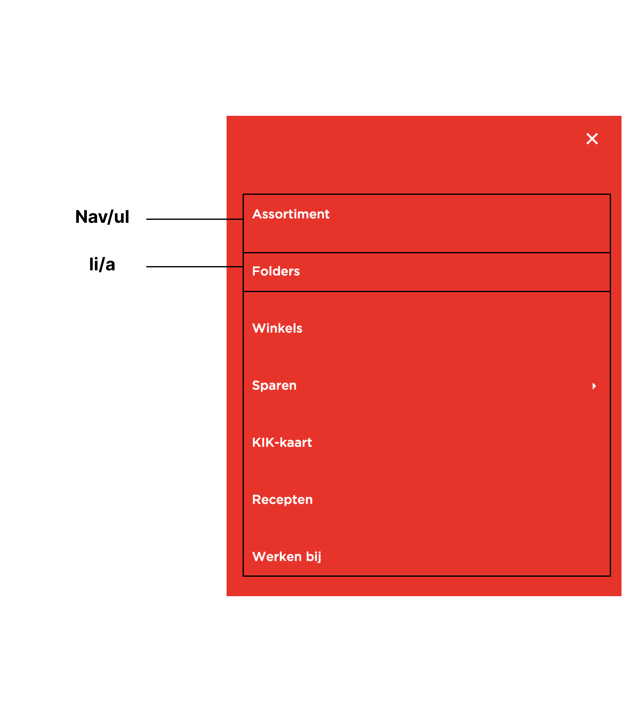

# Procesverslag
Markdown is een simpele manier om HTML te schrijven.  
Markdown cheat cheet: [Hulp bij het schrijven van Markdown](https://github.com/adam-p/markdown-here/wiki/Markdown-Cheatsheet).

Nb. De standaardstructuur en de spartaanse opmaak van de README.md zijn helemaal prima. Het gaat om de inhoud van je procesverslag. Besteedt de tijd voor pracht en praal aan je website.

Nb. Door *open* toe te voegen aan een *details* element kun je deze standaard open zetten. Fijn om dat steeds voor de relevante stuk(ken) te doen.

## Jij

  
uitwerken voor kick-off werkgroep

  ### Auteur:
  Tim den Braver

  #### Je startniveau:
  Blauw

  #### Je focus:
  Responsive
 

## Je website

  
uitwerken voor kick-off werkgroep

  ### Je opdracht:
  [link naar de website die je gaat namaken óf de naam/omschrijving van je eigen ontwerp](https://www.vomar.nl)

  #### Screenshot(s) van de eerste pagina (small screen): 
  Homepagina 
  
  

  #### Screenshot(s) van de tweede pagina (small screen):
  Recepten pagina  
  
  
 

## Toegankelijkheidstest 1/2 (week 1)

  
uitwerken na test in 2e werkgroep

  ### Bevindingen
  Lijst met je bevindingen die in de test naar voren kwamen:

  - Er kwamen veel errors naar boven zoals dat ze een 'img' element gebruiken zonder het attribuut 'src'.
  - De HTML was dus invalid
  - Veel errors ook door het vele gebruik van Div's.

## Breakdownschets (week 1)

  
uitwerken na afloop 3e werkgroep

  ### de hele pagina: 
  

  ### dynamisch deel (bijv menu): 
  

## Voortgang 1 (week 2)

  
uitwerken voor 1e voortgang

  ### Stand van zaken
  Ik heb de homepagina, recepten pagina, css en javascript aangemaakt en met elkaar gekoppeld. Verder heb ik al een begin gemaakt met het schrijven van mijn html op de homepagina.

  ### Agenda voor meeting
  samen met je groepje opstellen

**Sanne:** Ik heb tot nu toe nog niet echt vragen...

**Maeren:** Ik heb wel een aantal vraagjes, maar ik ben ook nog niet zo ver.

**Bente:** Ik heb wat vragen over toegankelijkheid en het formaat van foto's.

**Jamie:** Ik wil vragen om te kijken naar mijn html en nog een ander vraagje.

**Ik (Tim):** Ik wil een paar dingen vragen over mijn HTML en CSS en de opbouw hiervan.

  ### Verslag van meeting
  hier na afloop snel de uitkomsten van de meeting vastleggen

  - Opbouw ziet er prima uit
  - Zorg ervoor dat wanneer je een langer css bestand heb je wel overzicht kunt behouden
  - Denk aan meer ruimtes tussen de elementen en groeperen wat bij wat hoort
  - Zet :root bovenaan met de kleuren erin zodat je met var() elke keer die bestaande kleur kunt ophalen

## Voortgang 2 (week 3)

  
uitwerken voor 2e voortgang

  ### Stand van zaken
  Het opstellen en indelen van de website ging goed. Het stijlen van de website ging ook goed.
  Het menu maken is niet gelukt via de oefenopdracht op DLO.

  ### Agenda voor meeting
  samen met je groepje opstellen

**Stella:** Ik heb vragen over mijn hamburger menu.

**Maeren:** Ik heb vragen over mijn hamburger menu en een vraagje over hoe je een gedownload font op je website kan zetten.

**Bente:** Ik heb wat vragen over deze dingen: Responsive, Nav en uitklap menu, Grid voor foto galerij.

**Ik (Tim):** Ik heb ook vragen over mijn hamburger menu en hoe ik deze werkend kan maken.

  ### Verslag van meeting
  hier na afloop snel de uitkomsten van de meeting vastleggen

Feedback FED

-  De hanburgermenu button mag in javascript niet meer dan een paar regels bevatten en geen div
-  Alle Classes veranderen in Semantische HTML elementen
-  Lees meer linken naar Recepten pagina
-  Linkjes koppelen aan elke menu 
-  Outline ipv border gebruiken
-  Pseusoclasses checken
-  Animatie toevoegen aan sommige knoppen
-  Form - label voor zoekbalk
-  Button ‘zoek’ toevoegen aan rechterkant
-  Div mag alleen voor vormgeving
-  1 section om rode en kopjes eronder
-  Die kopjes allemaal articles
-  ‘Lees meer’ doorlinken naar recepten pagina
-  2 plaatjes van website pakken en dit zelf met css in elkaar zetten
-  Op DLO kijken voor tutorial drop down menu

## Toegankelijkheidstest 2/2 (week 4)

  
uitwerken na test in 9e werkgroep

  ### Bevindingen
  Lijst met je bevindingen die in de test naar voren kwamen (geef ook aan wat er verbeterd is):

  - Er was geen zichtbare focus style voor interactieve elementen dat genavigeerd was via het toetsenbord. Dat heb ik gefixt door de :focus state aan de interactieve elementen toe te voegen.
  - 'Check of de dark / light mode ondersteund wordt.' -> Dit was niet zo, in de checklist heb ik ook 'No' omcirkeld. Maar ik heb dit naderhand toegevoegd aan mijn website.
  - 'Check of high-contrast mode ondersteud wordt.' -> Dit was ook niet zo, maar ik heb dit aangepast en heb het nu wel verwerkt in mijn website.

## Voortgang 3 (week 4)

  
uitwerken voor 3e voortgang

  ### Stand van zaken
  Ik heb nu een goed werkend menu en alles is zo goed als responsive. Het eindresultaat komt in zicht en ben trots op wat ik tot nu toe heb bereikt en heb geleerd.
  Verder moet ik nog de :focus states toevoegen aan mijn linkjes en buttons en heb hier een paar vragen over in het feedbackgesprek.

  ### Agenda voor meeting
  samen met je groepje opstellen

**Sanne:** Ik heb een vraag over mijn img in de h1.

**Bente:** Ik heb vragen over mijn footer, responsive, javascript en een paar kleine dingen op mijn website.

**Ik (Tim):** Ik heb vragen over responsive, over de focus state en nog een laatste check van mijn hele website.

  ### Verslag van meeting
  hier na afloop snel de uitkomsten van de meeting vastleggen

  - Label boven het invulveld van mijn form
  - Dark achtergrond toevoegen. Dark mode werkt nu wel, maar het ziet er nog niet echt uit als een dark mode.
  - Verander de dark mode in High contrast mode, je hoeft dan maar een paar dingen aan te passen.
  - Check contrast door -> inspecteren -> hover over het element. Check door Aa of Aaa.
  - Alles mooi responsive maken! Mooie plekken voor op desktop mode -> De teksten zo groot laten als op mobile en alleen de witrumtes ernaast laten meeveren.
  - Voeg de focusstate toe. :focus ipv :hover en dan bijvoorbeeld kleur van tekst laten veranderen of er een border omheen zetten.

## Eindgesprek (week 5)

  
uitwerken voor eindgesprek

  ### Je uitkomst - karakteristiek screenshots:
  Hieronder zie je mijn homepagina op mobile formaat op light mode:
  
  

  Hieronder zie je mijn homepagina op desktop formaat op light mode:
  
  
  

  Hieronder zie je mijn homepagina op mobile formaat op dark mode:
  
  

  Hieronder zie je mijn homepagina op desktop formaat op dark mode:
  
  

----------------------------------------------------------------------

  Hieronder zie je mijn recepten pagina op mobile formaat op light mode:
  
  

  Hieronder zie je mijn recepten pagina op desktop formaat op light mode:
  
  
  

  Hieronder zie je mijn recepten pagina op mobile formaat op dark mode:
  
  

  Hieronder zie je mijn recepten pagina op desktop formaat op dark mode:
  
  

  ----------------------------------------------------------------------

  
  Hieronder zie je mijn menu uitgeklapt op mobile formaat op light mode:
  
  

  Hieronder zie je mijn menu op desktop formaat op light mode:
  
  

  ----------------------------------------------------------------------

  Hieronder zie je mijn form op mobile formaat die nog niet ingevuld is:
  
  
  

  Hieronder zie je mijn form op mobile formaat waarbij enkel de naam nog correct is ingevuld:
  
  

  Hieronder zie je mijn form op mobile formaat die volledig correct is ingevuld:
  
    

  ### Dit ging goed/Heb ik geleerd: 
  Korte omschrijving met plaatjes

  

  ### Dit was lastig/Is niet gelukt:
  Korte omschrijving met plaatjes

  

## Bronnenlijst

  
continu bijhouden terwijl je werkt

  Nb. Wees specifiek ('css-tricks' als bron is bijv. niet specifiek genoeg). 
  Nb. ChatGpT en andere AI horen er ook bij.
  Nb. Vermeld de bronnen ook in je code.

  1. www.chat.openai.com
  2. https://www.w3schools.com/tags/att_input_placeholder.asp
  3. https://www.dofactory.com/html/body/class
  4. https://codepen.io/shooft/pen/MWZYoXw
  5. https://dlo.mijnhva.nl/content/enforced/536487-FDMCI-2000FED121-DMCI-CMD-2324/FED%2023-24%20-%20Blok%201%20-%20Oefening%20flexbox.pdf
  6. https://codepen.io/shooft/pen/OJrPwyv
  7. https://dlo.mijnhva.nl/content/enforced/536487-FDMCI-2000FED121-DMCI-CMD-2324/FED%2023-24%20-%20Blok%201%20-%20Oefening%20toegankelijkheid%202%20van%202.pdf

